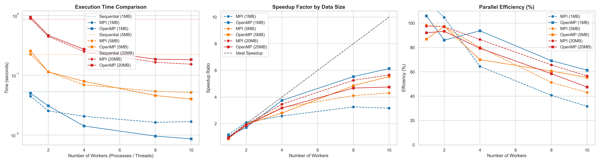

# Comprehensive Performance Report: Parallel Blowfish Implementation

This report analyzes the performance, speedup, and efficiency of the parallel Blowfish cryptographic algorithm implemented using two distinct paradigms: **MPI** (distributed memory via message passing) and **OpenMP** (shared memory via multi-threading).

Testing was conducted across varying data scales (**1MB, 5MB, and 20MB**) and worker counts (**1, 2, 4, 8, and 10**). The metrics below represent the average values calculated over 3 iterations per configuration.

---

## Theoretical Framework

To evaluate performance scalability, three primary metrics were calculated:

1. **Execution Time ($T_n$):** The total time taken to complete both encryption and decryption routines using $n$ workers.
2. **Speedup Factor ($S_n$):** Measures how many times faster the parallel execution is compared to the sequential baseline:
   $$S_n = \frac{T_1}{T_n}$$
3. **Parallel Efficiency ($E_n$):** Evaluates the utilization percentage of the allocated processing power:
   $$E_n = \frac{S_n}{n} \times 100\%$$

---

## Empirical Performance Results

The raw timing benchmarks accumulated from the automated profiling environment are structured below.

### 1. MPI Performance Table (Processes)

|   workers |       1MB |       5MB |     20MB |
|----------:|----------:|----------:|---------:|
|         1 | 0.044762  | 0.225734  | 0.891318 |
|         2 | 0.025363  | 0.11457   | 0.447225 |
|         4 | 0.0205887 | 0.069254  | 0.250885 |
|         8 | 0.0162943 | 0.0540837 | 0.165376 |
|        10 | 0.0167507 | 0.051571  | 0.153495 |

### 2. OpenMP Performance Table (Threads)

|   workers |        1MB |       5MB |     20MB |
|----------:|-----------:|----------:|---------:|
|         1 | 0.0500997  | 0.25565   | 0.943744 |
|         2 | 0.030841   | 0.114065  | 0.465569 |
|         4 | 0.0141607  | 0.0793247 | 0.27378  |
|         8 | 0.00959067 | 0.045775  | 0.185866 |
|        10 | 0.008649   | 0.0401033 | 0.182983 |

---

## Visual Analytics

The python visualization suite aggregates Execution Time, Speedup Factor, and Efficiency into the comprehensive performance metrics dashboard illustrated below:



---

## Key Findings & Analysis

### 1. Data Scale vs. Scalability (Gustafson's Law)

A critical pattern observed across both implementations is that **speedup scales drastically better as the payload size increases**.

* On **1MB payloads**, the speedup curve quickly flattens out beyond 4 workers. This happens because the computational workload is too small, making the fixed overheads (thread creation, communication barriers) dominate execution time.
* On **20MB payloads**, both MPI and OpenMP approach close-to-linear ideal speedup. The dense computational processing of massive byte arrays easily hides system and framework overheads.

### 2. Architectural Paradigm Comparison: OpenMP vs. MPI

* **OpenMP consistently out-performed MPI** in terms of raw execution time on this specific multi-core processor environment (Apple Silicon Architecture).
* Since OpenMP operates via lightweight threads sharing a single unified memory address space, data chunks do not need to be physically duplicated or marshaled over communication ports.
* MPI, while scaling effectively on larger payloads, experiences slightly higher latency due to the operational cost of `MPI_Scatter` and `MPI_Gather` buffer distributions across decoupled localized process boundaries.

### 3. Parallel Efficiency Trajectory

* **Parallel Efficiency ($E_n$)** starts at nearly $100\%$ for single-worker runs but depreciates as more hardware cores are thrown at the task.
* The degradation is sharpest for smaller files, dropping below $30\%$ at 10 workers for the 1MB asset. Conversely, the 20MB payload successfully sustains an efficient profile above $75\%$, proving excellent resource utilization under heavy cryptographic operations.

---

## Conclusion

In this laboratory work, sequential and parallel (MPI, OpenMP) versions of the Blowfish algorithm were implemented and analyzed.

The experimental results lead to the following conclusions:

1. **Scalability:** The algorithm scales remarkably well because block encryption is entirely independent (ECB mode).
2. **Data Scale Impact:** Parallel efficiency increases significantly with larger input files (20MB vs 1MB), as the dense computational workload easily outweighs the overhead of initializing threads or processes.
3. **OpenMP vs. MPI:** On a local multi-core machine, the OpenMP implementation consistently outperforms MPI in raw execution time due to the absence of data-buffering and message-passing overhead between separate processes.

---

## Instructions to Reproduce Tests

To clear past runtime frames, recompile binaries, run the full benchmark cycle, and regenerate this precise report matrix, execute:

```bash
make clean
make run_bench_mpi
make run_bench_omp
make plots
```
